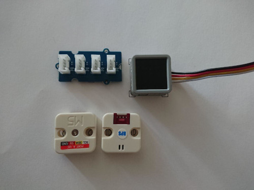
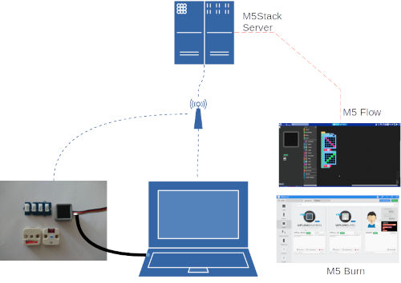
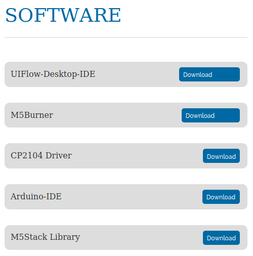

*Die deutsche Version ist [hier](./liesmich.md)*

## Setup
The sensor setup requires 4 components plus cables. 
We aim to provide a small platform to mount the sensors onto. 
If this fails, our arrangement will be a bit messy like the one below. However, it should work alike.

### Microcontroller 
ESP32 based development kit [Atom Matrix](https://m5stack.com/products/atom-matrix-esp32-development-kit)

### TVOC Sensor
TVOC/eCO2 Gas Sensor Unit [SGP30](https://m5stack.com/products/tvoc-eco2-gas-unit-sgp30)

### Temperature Sensor
Temperature and barometric pressure [BMP280](https://m5stack.com/collections/m5-unit/products/barometric-pressure-unitbmp280)

### I2C Hub
To connect all of the above we need the [hub](https://wiki.seeedstudio.com/Grove-I2C_Hub/) 

### Cables
We need 3 cables to connect sensors and controller to the hub. The have different length but essentially the same function. 

We also need a USB canble to hook up the Atom to your computer

## Software
We need to write a program to tell the microcontroller (the *atom*, remember?) how to read
the sensor values and how to show the results to us.

In order to accomplish this, we need a couple of tools as shown below:

From left to right, counterclockwise:
 * The atom and the sensors
 * Your computer, attached to the atom with a USB cable
   * Your computer needs to run a program called *M5Burn*, which does some basic things with the atom via the USB cable.
   * Your computer needs to open a webpage on the M5Stack server called [*M5Flow*](https://flow.m5stack.com/) which allows you to write the program for the atom. M5Flow also connects to your atom - not via USB but via the internet directly. This is the reason why your atom needs to connect to the internet as well. So, you must provide it with your wireless credentials. This is done with M5Burn. **Sounds complicated?** We're here to help.
 * M5Stack server provides you with a list of all the capabilities of your sensor system and how you can use them. It also takes care of translating **Your Program** into a format suitable for the microcontroller: computers read numbers while humans read letters and words - or pictures.

In case you've never written a program before: don't be afraid! On our *easy track* it'll be easier than you might think.

In case you're already familiar with Arduino or similar stuff: yes, there is a fast track as well. Skip over to the [quick intro](#quick-intro) after checking the [downloads section](#software-downloads).

### Software Downloads
The [download page](https://m5stack.com/pages/download) of M5Stack provides a couple of programs for all major platforms (Windows, MacOS and Linux):

We need M5Burner, please download and install the version for your operating system. You might also need the CP2104 driver (probably you don't if on Linux). This is all you need if you follow the *easy track*.

The UIFlow-Desktop-IDE is the equivalent to the M5Stack server, so you can run the development environment directly on your computer. Please note: we couldn't test this approach yet. So if you get stuck we might not be able to help immediately.

Arduino-IDE is a completely different kind of tool. While the atom is not an Arduino with respect to physical layout it is software compatible to a large extent. The M5Stack Library gives your Arduino-IDE access to all the features of the atom and the sensors. No *blockly* neither *python* though - but we didn't talk about that anyway yet.

### Slow Intro
... not yet written ...

### Quick Intro
... not yet written ...

